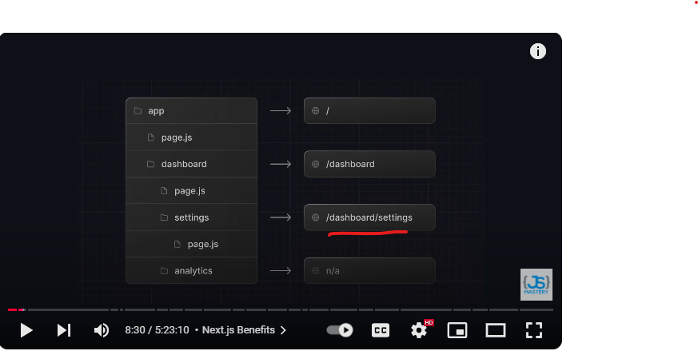

## ---------------------------------     
1) the first advantage of next-js is besically in react there are two types of components one is class based and second is functionall based component but later in react-19 it has categories in two ways as client component and server component so server component as more faster than client component and next js convert all the react component into server componet unless we don't specifie that this particular component should not to server component.
2) second befinet is the way in which it handle the ui, in react-19 it supports the server components and in next-js it extends then to more hight level rendering strategies allow you to choose when and where to render that component
3) third banefit is react-router in react we have to download the react router separate but in next-js don't need to download it separate.
4) nex-js follow the file based routing based on file manage in project it will render the componets.
5)  
6) to create a next-js project or app write below command in your command line 
7) npx create-next-app@latest

